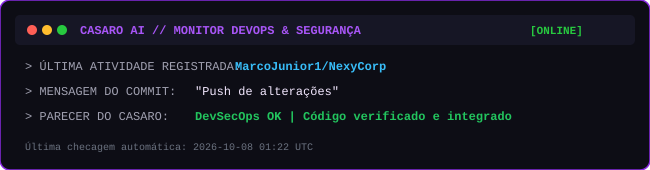

  

 

  

 

  

### Engenheiro de Software | Desenvolvedor FullStack | Entusiasta de IA

Sou apaixonado por tecnologia, automação e inteligência artificial. Crio soluções inteligentes integrando o melhor do desenvolvimento moderno e a experiência do usuário.

  

---

## Painel em Tempo Real: Monitoramento Casaro AI

  

---

## Projeto em Destaque: Casaro - AI Voice Assistant
O Casaro é meu assistente de IA desktop em Python.
Veja o repositório oficial: [ai-voice-assistant-desktop-python](https://github.com/MarcoJunior1/ai-voice-assistant-desktop-python)

---

## Tecnologias e Arsenal

  

---

## Estatísticas e Atividade de Commits

  

 

  
    
  
    
  

 

  

