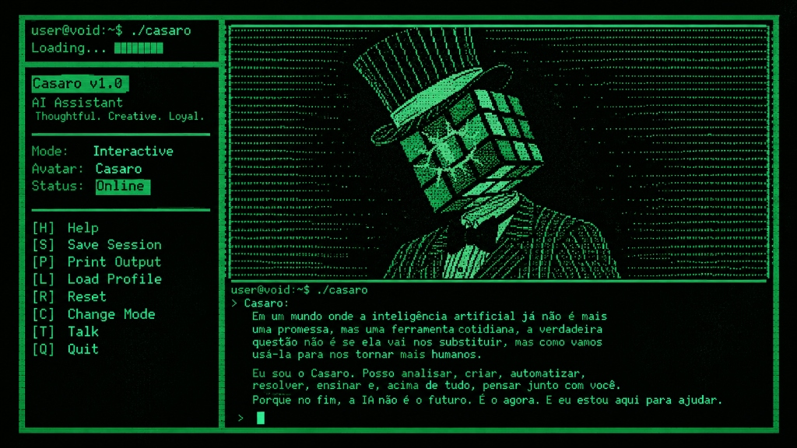

  

 

# Olá, eu sou Marco Júnior
### DevSecOps | Engenheiro de Software | Entusiasta de IA

Sou apaixonado por tecnologia, segurança, automação e inteligência artificial. Crio soluções que integram o melhor do desenvolvimento com a confiabilidade e segurança que o mundo moderno exige.

  

---

  

 

  

---

## Projeto em Destaque: Casaro - AI Voice Assistant
O Casaro é meu assistente de IA desktop em Python.
Veja o repositório oficial: [ai-voice-assistant-desktop-python](https://github.com/MarcoJunior1/ai-voice-assistant-desktop-python)

---

## Tecnologias e Arsenal

  <!-- Linguagens -->
  
  
  
  
  
  
  
  
  
   
  <!-- Frameworks e Ferramentas -->
  
  
  
  
  
  
   
  <!-- Infra, Cloud e Banco de Dados -->
  
  
  
  
  
  
  
  
  
  
  
   
  <!-- OS & Security -->
  
  
  
  
   
  <!-- AI's -->
  
  
  

---

## Estatísticas do GitHub (Animações e Commits)

  
    
  
    
  <picture>
    <source media="(prefers-color-scheme: dark)" srcset="https://raw.githubusercontent.com/MarcoJunior1/MarcoJunior1/output/github-contribution-grid-snake-dark.svg">
    <source media="(prefers-color-scheme: light)" srcset="https://raw.githubusercontent.com/MarcoJunior1/MarcoJunior1/output/github-contribution-grid-snake.svg">
    
  </picture>

 

  

