  

 

  

### DevSecOps | Engenheiro de Software | Entusiasta de IA

Sou apaixonado por tecnologia, segurança, automação e inteligência artificial. Crio soluções que integram o melhor do desenvolvimento com a confiabilidade e segurança que o mundo moderno exige.

  

---

## Projeto em Destaque: Casaro - AI Voice Assistant
O Casaro é meu assistente de IA desktop em Python.
Veja o repositório oficial: [ai-voice-assistant-desktop-python](https://github.com/MarcoJunior1/ai-voice-assistant-desktop-python)

---

## Tecnologias e Arsenal

  

 

  <!-- Linguagens -->
  
  
  
  
  
  
  
  
  
   
  <!-- Frameworks e Web -->
  
  
  
  
  
  
   
  <!-- Infra, Cloud e Banco de Dados -->
  
  
  
  
  
  
  
  
  
  
  
   
  <!-- OS, Segurança e Ferramentas -->
  
  
  
  
  
  
  
  
  
   
  <!-- Inteligências Artificiais -->
  
  
  

---

## Estatísticas e Atividade de Commits

  

 

  
    
  
    
  

 

  

